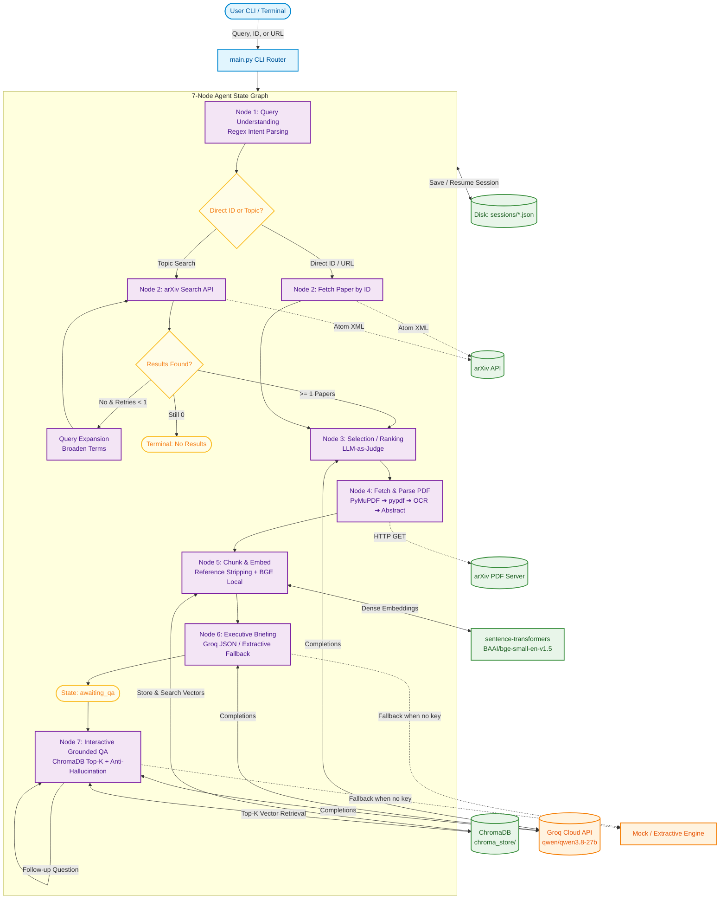
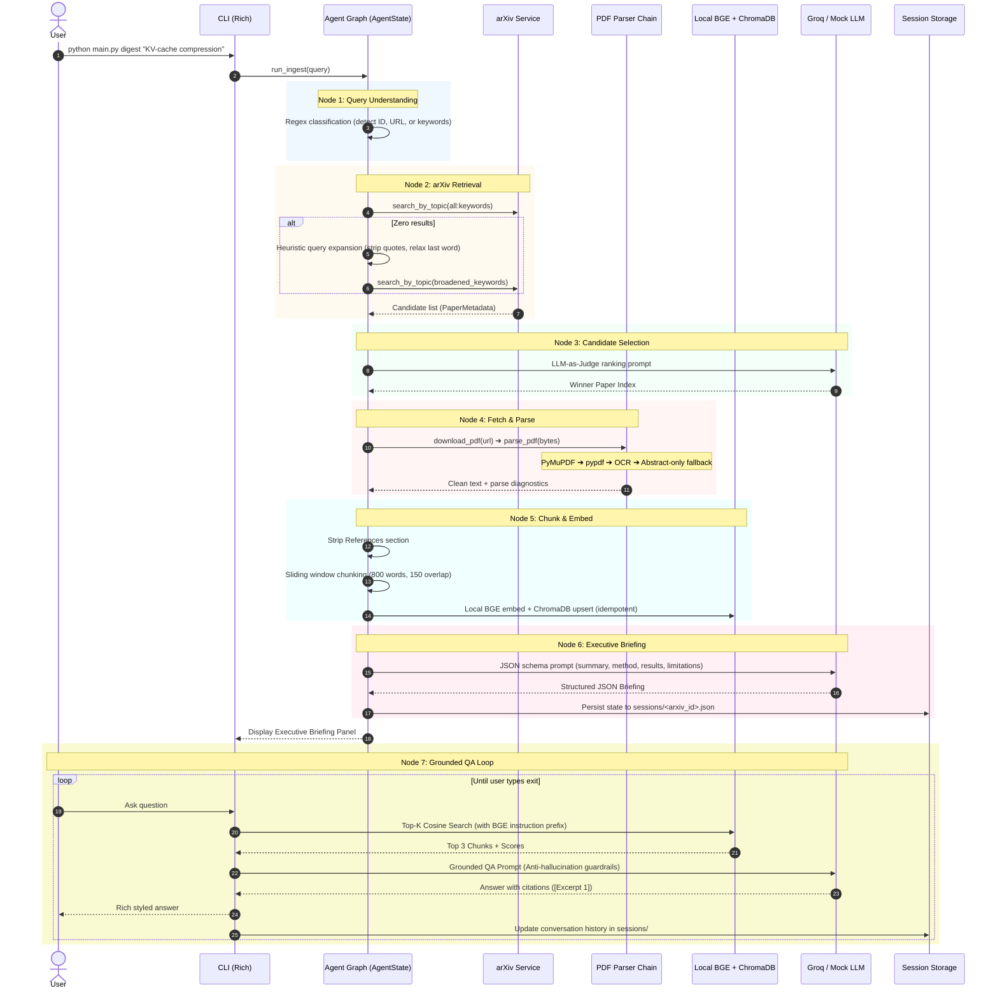
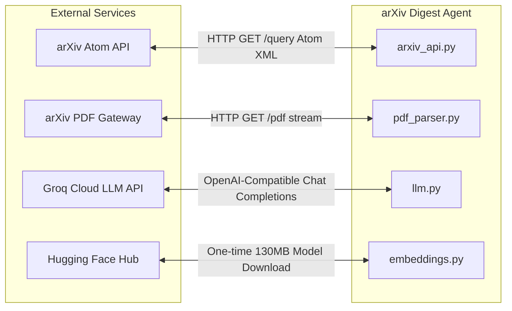
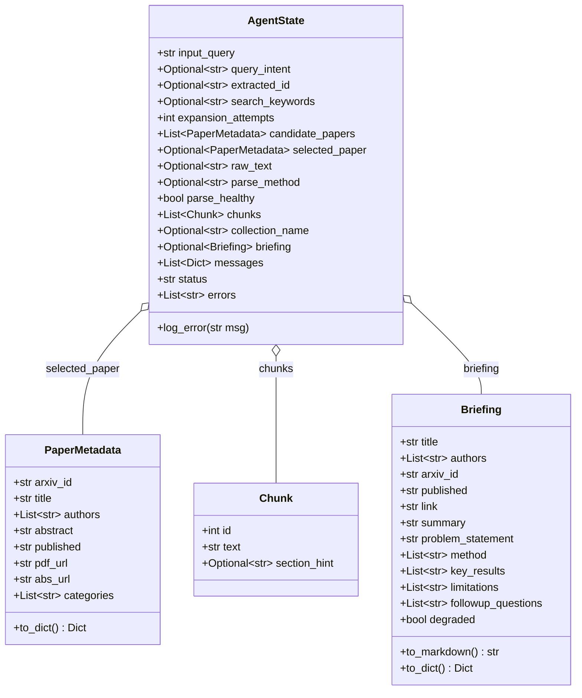
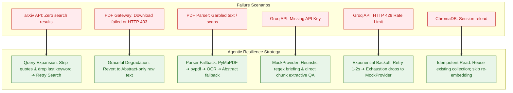

# 🔬 Autonomous arXiv Paper Digest & QA Agent

[](https://www.python.org/downloads/)
[](https://opensource.org/licenses/MIT)
[](https://www.trychroma.com/)
[](https://huggingface.co/BAAI/bge-small-en-v1.5)
[](https://console.groq.com)
[](https://github.com/Textualize/rich)

> **An autonomous pair-researcher CLI agent** that turns dense academic papers on arXiv into structured executive briefings and interactive, grounded RAG Q&A sessions. It features deterministic routing, zero-cost heuristic fallbacks, offline capability, and disk-persisted vector storage.

---

## 📑 Table of Contents

- [✨ Key Features](#-key-features)
- [🏗️ High-Level System Architecture](#️-high-level-system-architecture)
  - [💡 The Architecture in Simple Words (Plain English)](#-the-architecture-in-simple-words-plain-english)
- [🔄 Agent Loop & Techniques (Start to End)](#-agent-loop--techniques-start-to-end)
- [🛠️ Tech Stack & Technical Rationale](#️-tech-stack--technical-rationale)
- [🔌 Major APIs, Protocols & Schemas](#-major-apis-protocols--schemas)
- [📋 Functional & Non-Functional Requirements](#-functional--non-functional-requirements)
- [🛡️ Cascading Fallbacks & Resilience Matrix](#️-cascading-fallbacks--resilience-matrix)
- [🚀 Quickstart & Interactive Walkthrough](#-quickstart--interactive-walkthrough)
  - [📸 Live Ingestion Demos in Action](#-live-ingestion-demos-in-action)
- [🎬 Video Presentation & Demo Blueprint](#-video-presentation--demo-blueprint)
- [📂 Project Directory Layout](#-project-directory-layout)

---

## ✨ Key Features

- **Dual-Mode Operation (Cloud or 100% Offline):** Runs with Groq API for lightning-fast LLM inference, or completely zero-key and offline with heuristic rule-based summarization and extractive RAG.
- **Deterministic Intent & Query Routing:** Regex patterns classify queries into direct IDs, arXiv URLs, or free-text research topics without burning expensive LLM tokens.
- **Self-Healing Search:** Automated heuristic query expansion broadens search terms if zero papers are returned initially.
- **LLM-as-a-Judge Candidate Ranking:** Evaluates multiple paper candidates by title and abstract to select the most relevant match for your query.
- **Cascading 4-Tier PDF Ingestion:** PyMuPDF (layout-aware blocks) ➔ pypdf ➔ Tesseract OCR ➔ Abstract-only graceful degradation.
- **Local Dense Embeddings:** Runs `BAAI/bge-small-en-v1.5` locally on CPU with asymmetric search prefixes and cosine normalization.
- **Persistent ChromaDB Vector Store:** Isolated collections tagged by paper ID and embedding model. Never re-indexes a paper twice.
- **Strict Anti-Hallucination QA:** System prompts force the LLM to cite excerpts (e.g. `[Excerpt 1]`) and respond with an exact refusal phrase when information is absent.
- **Durable Session Persistence:** Session states and conversation histories are stored in human-readable JSON files, allowing you to resume Q&A anytime.

---

## 🏗️ High-Level System Architecture

<p align="center">
  
</p>

### 💡 The Architecture in Simple Words (Plain English)

Imagine having a **tireless, super-fast research partner** sitting inside your terminal. Here is how the agent processes your requests in plain, everyday language:

1. **Instant Query Routing (No Wasted Money):** When you type a query, the agent doesn't waste expensive AI tokens asking *"is this a link or a topic?"*. Instead, a lightning-fast regular expression checks if you provided an arXiv ID (`2401.12345`) or an arXiv URL. If yes, it fetches that exact paper immediately. If it's a general topic like `"KV-cache compression"`, it triggers an academic search.
2. **Self-Healing arXiv Search:** The agent queries arXiv's official search engine. If your search terms were too specific and returned 0 papers, it doesn't give up! It automatically loosens quotes, removes parenthetical filters, and drops trailing keywords to retry the search on its own.
3. **Smart Paper Selection (LLM Judge):** When a topic search returns multiple papers, an AI judge reads their titles and abstracts to pick the single most relevant paper for your request.
4. **Bulletproof 4-Tier PDF Reader:** Academic PDFs are notorious for complex two-column layouts, weird fonts, and scanned figures. The agent uses a safety-ladder approach: it tries **PyMuPDF** (preserving two-column reading order) ➔ then **pypdf** ➔ then **OCR image reading**. If the PDF is completely broken or unreachable, it gracefully falls back to using the abstract. **The agent never crashes.**
5. **Local & Free Vector Memory (ChromaDB + BGE Embeddings):** It strips out references and bibliographies to keep search results clean, divides the paper into 800-word chunks, and converts them into mathematical vectors using a **local, 100% offline model (`BGE-small`) running directly on your CPU**. It stores these vectors into a local **ChromaDB** database on disk. You don't pay a single cent for embeddings, and it never re-processes a paper you've already indexed.
6. **Executive Briefing Card:** It feeds the clean text to **Groq's ultra-fast Qwen model** to produce a structured, high-impact briefing (Summary, Problem Statement, Method, Key Results, and Inferred Limitations). If you don't have an API key, an offline heuristic extractor creates the briefing for you.
7. **Anti-Hallucination Q&A with Receipts:** When you ask questions about the paper, the agent retrieves the top 3 relevant paragraphs from ChromaDB and tells the model: *"Answer using ONLY these excerpts and cite them like [Excerpt 1]. If the answer isn't in the text, say you don't know."* No hallucinations, no guessing.
8. **Durable Session Memory:** Everything is saved to clean, human-readable JSON files in `sessions/`. You can close your laptop, come back days later, and run `python main.py qa <arxiv_id>` to continue asking questions instantly.



---

## 🔄 Agent Loop & Techniques (Start to End)

The agent processes information across seven discrete, measurable pipeline nodes. Below is the complete step-by-step technique breakdown:



### Detailed Node Breakdown

<details>
<summary><b>🔍 Node 1: Deterministic Query Understanding</b></summary>

- **Technique:** Regex-based zero-cost intent detection.
- **Pattern Matching:**
  - `_ARXIV_ID_RE = re.compile(r"(\d{4}\.\d{4,5})(v\d+)?")`
  - `_ARXIV_URL_RE = re.compile(r"arxiv\.org/(?:abs|pdf)/(\d{4}\.\d{4,5})(v\d+)?")`
- **Logic:**
  1. Checks if the query contains an explicit arXiv URL.
  2. Checks for exact ID patterns (e.g. `2401.12345`).
  3. Looks for loose IDs in short queries (`"summarize 2401.12345 for me"`).
  4. Otherwise routes to `"topic_search"` with extracted keywords.
- **Why No LLM?** Saves latency and cost for queries with rigid structural identifiers.
</details>

<details>
<summary><b>📡 Node 2: arXiv Retrieval & Heuristic Query Expansion</b></summary>

- **Technique:** Official arXiv API querying using the Atom feed specification.
- **Keyword Enrichment:** Formats free-text search queries as `all:<keywords>` to match across paper title, abstract, and indexed metadata simultaneously.
- **Query Expansion Heuristic:**
  - If `0` candidates are returned, the query expansion loop activates.
  - Strips double-quoted exact-phrase constraints: `re.sub(r'"[^"]*"', "", q)`
  - Strips parenthetical filters: `re.sub(r"\([^)]*\)", "", q)`
  - Removes the least critical / most specific trailing keyword.
  - Retries the arXiv API search automatically once before declaring failure.
</details>

<details>
<summary><b>🏆 Node 3: Selection / Ranking (LLM-as-a-Judge)</b></summary>

- **Technique:** Few-candidate decision arbitration.
- **Logic:**
  - If `len(candidates) == 1`, bypasses the LLM and selects immediately.
  - If multiple candidates exist, builds an enumeration prompt containing candidate titles and the first 400 characters of each abstract.
  - Instructs the LLM to output **only the integer index** of the most relevant match.
  - Parses digits from the response. If parsing fails or the LLM is offline, falls back safely to Candidate 1 (the most recent paper).
</details>

<details>
<summary><b>📥 Node 4: Multi-Engine PDF Fetch & Cascading Parser</b></summary>

- **Technique:** 4-tier cascading fallback for document extraction.
- **Engines:**
  1. **PyMuPDF (`fitz`):** Extracts structural text blocks sorted by coordinates `(round(y, 1), round(x, 1))` to preserve two-column academic reading order.
  2. **pypdf:** Independent pure-Python stream reader fallback.
  3. **OCR (pdf2image + pytesseract):** Rasterizes PDF pages at 200 DPI and performs optical character recognition (optional system dependencies).
  4. **Abstract-Only Degradation:** If all parsers fail or the PDF cannot be downloaded, sets `raw_text = abstract`, `parse_method = "abstract_only"`, and marks `parse_healthy = False`.
- **Health Checks:** A parsed text is only accepted if:
  - Total length $\ge 1000$ characters.
  - Unicode replacement character ratio (`\ufffd`) $\le 2\%$.
  - Alphanumeric character ratio $\ge 40\%$.
</details>

<details>
<summary><b>🧩 Node 5: Noise Stripping, Chunking & Dense Embeddings</b></summary>

- **Technique:** Reference pruning + sliding-window chunking + asymmetric dense retrieval.
- **Reference Stripping:** Detects `References` or `Bibliography` headers past the 40% mark of the paper and discards everything after to prevent bibliography clutter in the vector store.
- **Sliding Window:** 800-word chunks with 150-word overlaps. Word-based tokenization eliminates tokenizer dependencies while maintaining $\sim 1000$ token segments.
- **Dense Embedding Model:** `BAAI/bge-small-en-v1.5` (33M parameters, 384 dimensions, CPU optimized).
- **Asymmetric Prefixing:** Queries receive the BGE instruction prefix:
  `"Represent this sentence for searching relevant passages: "`
  Document passages are embedded without the prefix. This asymmetric encoding boosts recall significantly.
- **Vector Storage:** ChromaDB collection named `paper_{sanitized_id}_{embedding_tag}` using cosine distance. Skips re-indexing if the collection count matches the chunk count.
</details>

<details>
<summary><b>📝 Node 6: Executive Briefing Generation</b></summary>

- **Technique:** Strict JSON schema extraction with heuristic fallback.
- **Structured Fields:**
  - `summary`: One-paragraph overview in plain English.
  - `problem_statement`: Core gap or challenge addressed.
  - `method`: List of concrete architectural/algorithmic points.
  - `key_results`: Benchmark metrics and empirical claims.
  - `limitations`: Inferred or explicitly stated boundaries (guaranteed non-empty).
  - `followup_questions`: 3 provocative technical questions.
- **Resilience:** If the LLM output fails JSON parsing or the LLM is absent, an extractive regex engine scans headers for `method`, `results`, and `limitations` to construct the briefing without crashing.
</details>

<details>
<summary><b>💬 Node 7: Grounded Q&A with Anti-Hallucination Guardrails</b></summary>

- **Technique:** Single-hop RAG with strict factual grounding.
- **Process:**
  1. Computes query embedding using the BGE search prefix.
  2. Retrieves Top-$k$ (default: 3) chunks from ChromaDB by cosine similarity.
  3. Formats chunks as `[Excerpt N, relevance=X.XX]`.
  4. Prompt restricts the LLM to use **ONLY** the provided excerpts and paper info.
  5. Mandates the exact refusal sentence if answers are not present:
     > *"The provided text does not contain sufficient information to answer this question."*
  6. Mandates inline citations (`[Excerpt 1]`).
  7. If offline or no key, returns the highest-scoring passage directly in an extractive answer card.
</details>

---

## 🛠️ Tech Stack & Technical Rationale

| Layer | Component | Technology | Rationale |
|---|---|---|---|
| **Language** | Runtime | **Python 3.10+** | Modern type hinting, rich ecosystem for ML/data/CLI. |
| **LLM Inference** | Primary Provider | **Groq Cloud API** | Sub-second TTFT (Time-to-First-Token), free developer tier, Qwen 2.5 / Llama 3 models. |
| **Default Model** | Foundation Model | `qwen/qwen3.8-27b` | Exceptional structured JSON following, 131k context window, low hallucination rate. |
| **Offline LLM** | Fallback Provider | **MockProvider (Custom)** | Deterministic regex-based extractor for zero-key, zero-network environments. |
| **Embedding Engine** | Local Model | `BAAI/bge-small-en-v1.5` | SOTA MTEB retrieval performance at 33M parameters; runs fast on CPU with no API key needed. |
| **Vector Database** | Storage & Indexing | **ChromaDB (Persistent)** | Embedded vector store on disk (`chroma_store/`); HNSW cosine space; eliminates cloud vector DB overhead. |
| **PDF Extraction** | Multi-Tier Engine | **PyMuPDF + pypdf + Tesseract** | Fast layout-preserving two-column reading order with multi-tier degradation. |
| **arXiv Protocol** | Data Ingestion | **arxiv (Python SDK)** | Direct client wrapper over arXiv's Atom XML syndication API. |
| **State Persistence** | Session Storage | **JSON on Disk (`sessions/`)** | Human-inspectable, safe against pickle vulnerabilities, stores conversation state across CLI runs. |
| **CLI / UI** | Presentation | **Rich** | Spinners, formatted markdown panels, colorful logs, and clean terminal tables. |

---

## 🔌 Major APIs, Protocols & Schemas

### 1. External APIs Used



- **arXiv Search API:**
  - Protocol: HTTP GET against `export.arxiv.org/api/query` returning Atom 1.0 XML.
  - Endpoints exercised: `Search(query="all:...", sort_by=Relevance)` and `Search(id_list=[arxiv_id])`.
- **Groq Cloud Chat Completions API:**
  - Protocol: HTTPS REST (OpenAI-compatible) endpoint `https://api.groq.com/openai/v1/chat/completions`.
  - Headers: `Authorization: Bearer <GROQ_API_KEY>`.
  - Parameters: `model="qwen/qwen3.8-27b"`, `temperature=0.2`, `max_tokens=4096`.
  - Rate-limit handling: Exponential backoff on HTTP 429 and transient 5xx errors.
- **Hugging Face Hub Model Repository:**
  - Protocol: HTTPS download on first launch for `BAAI/bge-small-en-v1.5` weights ($\sim 130$ MB), cached locally in `~/.cache/huggingface/hub/`.

### 2. Core Data Schemas



---

## 📋 Functional & Non-Functional Requirements

### 🎯 Functional Requirements (FR)

| ID | Requirement | Implementation Detail |
|---|---|---|
| **FR-01** | Flexible Input Ingestion | Accept raw topic strings, exact 8-digit arXiv IDs (`2401.12345`), or full URLs (`https://arxiv.org/abs/...`). |
| **FR-02** | Deterministic Query Parsing | Differentiate IDs vs free-text search using regex before allocating network/LLM calls. |
| **FR-03** | Automated Paper Retrieval | Search papers via the official arXiv Atom feed and parse author, abstract, dates, and links. |
| **FR-04** | Autonomous Query Expansion | Broaden queries automatically if 0 results match, preventing blank returns. |
| **FR-05** | Candidate Arbitration | Rank multiple matching papers using LLM-as-a-judge prompt or fall back to date recency. |
| **FR-06** | Robust PDF Extraction | Stream PDF bytes and sequentially attempt PyMuPDF, pypdf, and OCR with character health validation. |
| **FR-07** | Semantic Document Chunking | Strip references and divide body text into 800-word chunks with 150-word sliding window overlaps. |
| **FR-08** | Dense Vector Indexing | Generate 384-dimensional dense vectors using local BGE model and store persistently in ChromaDB. |
| **FR-09** | Executive Briefing | Synthesize a 6-part structured briefing (Summary, Problem, Method, Results, Limitations, Follow-up Questions). |
| **FR-10** | Interactive Grounded Q&A | Provide a terminal Q&A loop backed by ChromaDB Top-3 cosine retrieval with excerpt citations. |
| **FR-11** | Conversation History & Resume | Persist all state into `sessions/<arxiv_id>.json` allowing session resumption with `main.py qa <id>`. |
| **FR-12** | Offline Demo Mode | Bundle a local synthetic paper (`sample_paper.txt`) to run end-to-end without internet access. |

### ⚡ Non-Functional Requirements (NFR)

| ID | Category | Requirement & Implementation |
|---|---|---|
| **NFR-01** | **Fault Tolerance & Graceful Degradation** | The system must **never crash** due to missing API keys, corrupt PDFs, or rate limits. Degradation path drops to extractive heuristics and abstract-only summaries. |
| **NFR-02** | **Hallucination Mitigation** | Strict negative constraints in QA prompt. If information is missing from retrieved chunks, agent refuses to guess. |
| **NFR-03** | **Zero-Configuration Usability** | Works out-of-the-box without requiring an API key. Local model auto-downloads on first run. |
| **NFR-04** | **Idempotent Storage & Performance** | Papers already embedded in ChromaDB bypass redundant embedding calculations. Repeated queries load in milliseconds. |
| **NFR-05** | **Privacy & Local Computing** | Embeddings and vector searches remain 100% on the local machine. Only text excerpts sent to Groq when configured. |
| **NFR-06** | **Low Latency** | Groq inference provides sub-second token delivery; local BGE model completes inference in $< 200$ms on CPU. |
| **NFR-07** | **Platform Portability** | Pure Python implementation running identically on Linux, macOS, and Windows. |

---

## 🛡️ Cascading Fallbacks & Resilience Matrix



---

## 🚀 Quickstart & Interactive Walkthrough

### 1. Installation

```bash
# Clone repository
git clone https://github.com/your-username/arxiv-agent.git
cd arxiv-agent

# Create virtual environment
python3 -m venv venv
source venv/bin/activate    # On Windows: venv\Scripts\activate

# Install dependencies
pip install -r requirements.txt
```

### 2. Environment Configuration (Optional)

```bash
# Copy template
cp .env.example .env

# Set your Groq API key (optional — free tier at https://console.groq.com)
# If left blank, the agent runs in 100% offline extractive fallback mode!
nano .env
```

### 3. Usage Commands

<details open>
<summary><b>📖 Click to expand command examples</b></summary>

```bash
# 1. Digest by research topic (enters interactive QA loop automatically)
python main.py digest "KV-cache compression for LLMs"

# 2. Digest by explicit arXiv ID
python main.py digest 2401.12345

# 3. Digest by web URL
python main.py digest https://arxiv.org/abs/2401.12345

# 4. Generate briefing only and exit immediately (skip QA)
python main.py digest 2401.12345 --no-qa

# 5. Resume interactive QA session for an already processed paper
python main.py qa 2401.12345

# 6. View table of all saved local sessions
python main.py sessions

# 7. Run offline demo with bundled synthetic paper (no internet needed)
python main.py demo
```
</details>

### 📸 Live Ingestion Demos in Action

<table width="100%">
  <tr>
    <th width="50%" align="center"><b>Direct Paper ID Digest (<code>python main.py digest 2401.12345</code>)</b></th>
    <th width="50%" align="center"><b>Topic Search Digest (<code>python main.py digest "KV-cache compression for LLMs"</code>)</b></th>
  </tr>
  <tr>
    <td align="center">
      
    </td>
    <td align="center">
      
    </td>
  </tr>
</table>

---

## 🎬 Video Presentation & Demo Blueprint

If you are recording a demo, walkthrough, or video presentation of this agent, use this battle-tested 4-minute script:

```mermaid
journey
    title 4-Minute Video Presentation Flow
    section 00:00 - 00:45 Intro
      Show problem: Dense 30-page PDF: 5: Presenter
      Introduce arXiv Digest Agent solution: 5: Presenter
    section 00:45 - 01:45 Live Digest
      Run main.py digest: 5: Terminal
      Highlight Rich spinners & 7-node pipeline: 5: Terminal
      Show structured Executive Briefing: 5: Terminal
    section 01:45 - 02:45 Grounded QA
      Ask specific benchmark question: 5: User
      Show inline excerpt citations: 5: Terminal
      Test anti-hallucination guardrail: 5: Terminal
    section 02:45 - 03:45 Architecture & Fallbacks
      Explain 7-node state machine: 5: Architecture
      Explain offline fallback & ChromaDB persistence: 5: Architecture
    section 03:45 - 04:00 Outro
      Show python main.py sessions: 5: Terminal
      Closing wrap-up: 5: Presenter
```

### Talking Points by Timestamp

- **[0:00 - 0:45] The Hook:**
  - *"Researchers and engineers are flooded with dozens of new arXiv papers every week. Reading full 30-page PDFs just to find benchmarks and limitations is inefficient."*
  - *"Meet the Autonomous arXiv Digest Agent: a command-line pair-researcher that searches, parses, indexes, and briefs you on any paper in seconds."*
- **[0:45 - 1:45] The Ingestion & Briefing Demo:**
  - Run: `python main.py digest "KV-cache compression for LLMs"`
  - Point out the terminal spinners showing Node 1 to Node 6 in real time.
  - Explain the 6-part executive briefing: Why This Paper Matters, Problem Statement, Method, Key Results, Limitations, and Suggested Questions.
- **[1:45 - 2:45] Grounded RAG & Anti-Hallucination:**
  - Ask: *"What datasets were used to evaluate this method?"*
  - Show the response citing `[Excerpt 1]`.
  - Ask an impossible question: *"What is the author's personal phone number?"*
  - Show the exact refusal guardrail: *"The provided text does not contain sufficient information to answer this question."*
- **[2:45 - 3:30] Technical Highlights:**
  - Point to **local BGE embeddings** (no OpenAI embedding cost, runs offline on CPU).
  - Point to **ChromaDB disk persistence** (re-indexing is avoided; instant resume).
  - Point to **cascading PDF parsers** (PyMuPDF ➔ pypdf ➔ OCR ➔ Abstract).
- **[3:30 - 4:00] Session Resumption:**
  - Exit the QA loop (`exit`).
  - Run: `python main.py sessions` to show the persisted catalog.
  - Run: `python main.py qa <arxiv_id>` to show immediate resume without re-fetching.

---

## 📂 Project Directory Layout

```
arxiv-agent/
├── main.py                 # CLI entry point (argparse subcommands)
├── requirements.txt        # Pinned core dependencies
├── .env.example            # Environment template for GROQ_API_KEY
├── sample_data/
│   └── sample_paper.txt    # Synthetic paper for zero-network demo mode
├── sessions/               # Created at runtime: JSON session files per paper
├── chroma_store/           # Created at runtime: Persistent ChromaDB vector collections
└── src/
    ├── __init__.py         # Package initialization
    ├── config.py           # Centralized configuration & environment constants
    ├── models.py           # Core dataclasses: AgentState, PaperMetadata, Briefing, Chunk
    ├── arxiv_api.py        # Node 1 (Intent) & Node 2 (arXiv Search + Query Expansion)
    ├── pdf_parser.py       # Node 4 (Download + PyMuPDF/pypdf/OCR parsing chain)
    ├── chunking.py         # Node 5a (Reference section stripping & sliding window chunking)
    ├── embeddings.py       # Node 5b (Local BGE sentence-transformers with query prefix)
    ├── vectorstore.py      # ChromaDB client & cosine similarity retrieval
    ├── llm.py              # GroqProvider, MockProvider & AutoLLMProvider fallback
    ├── briefing.py         # Node 6 (Structured JSON briefing generation)
    ├── qa.py               # Node 7 (Grounded anti-hallucination RAG QA)
    ├── graph.py            # Orchestrator: 7-Node Agent State Graph runner
    ├── session.py          # Session persistence (save, load, list)
    └── cli.py              # Rich terminal interface (panels, spinners, tables)
```

---

<div align="center">
Built with ❤️ using Groq, ChromaDB, sentence-transformers, and Rich.
</div>
